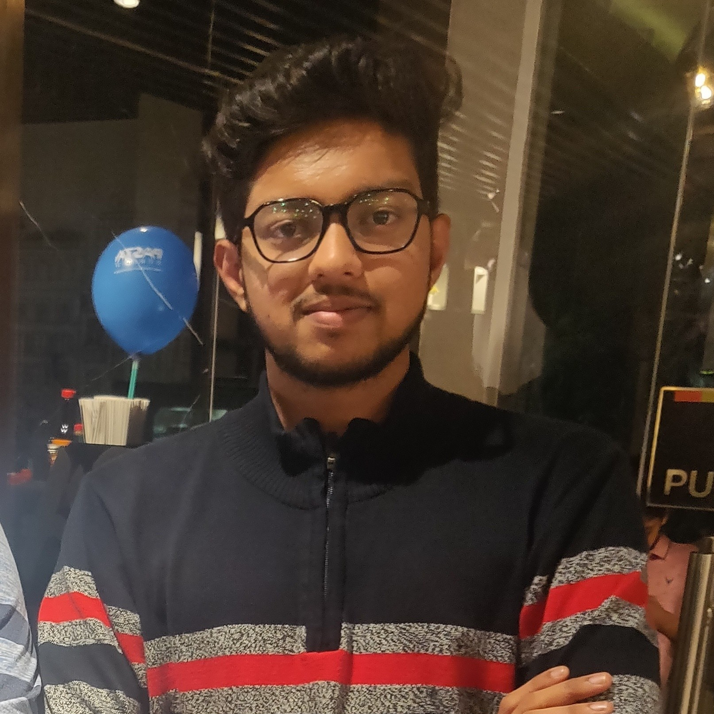
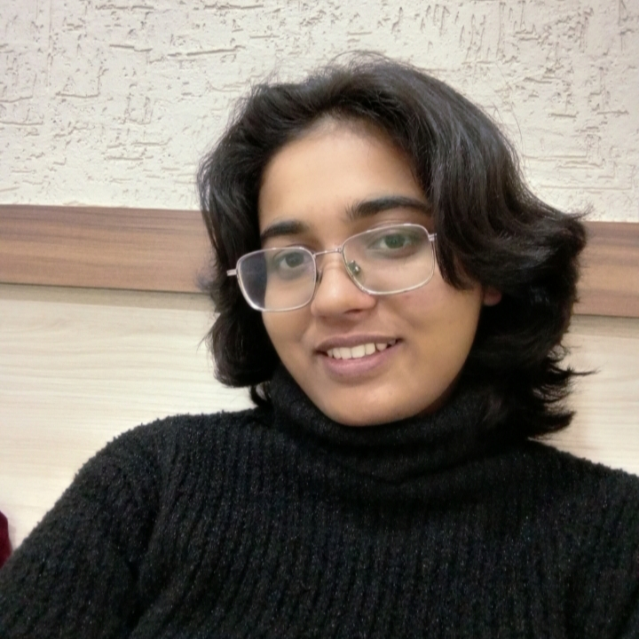
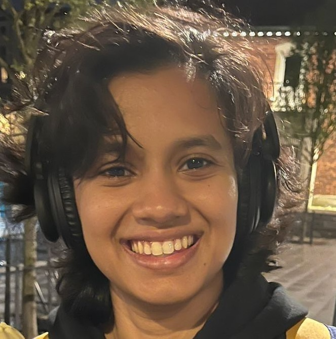
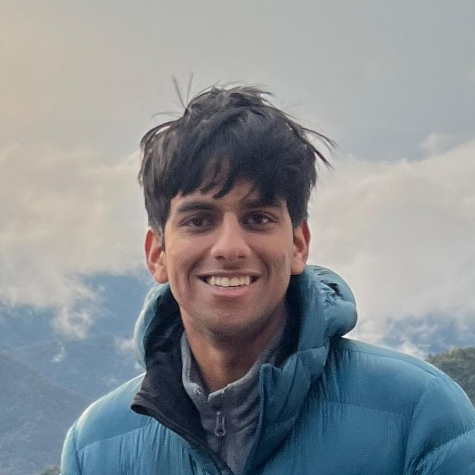
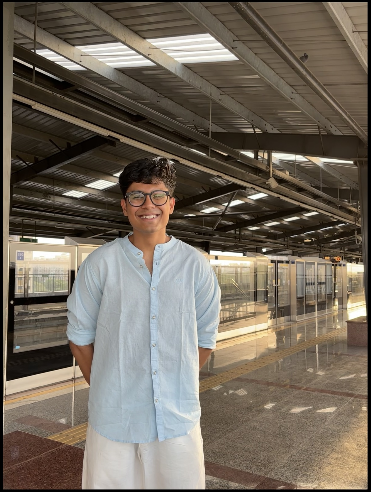
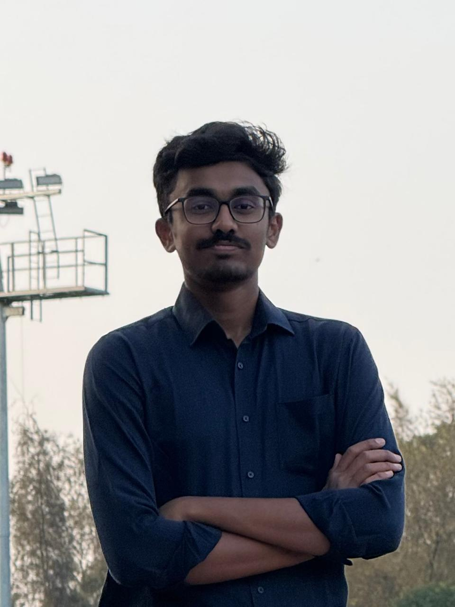
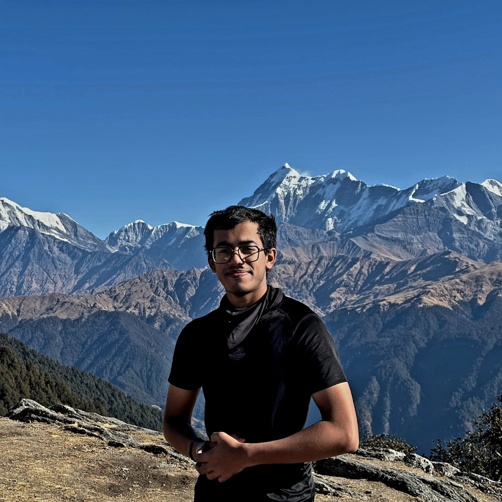
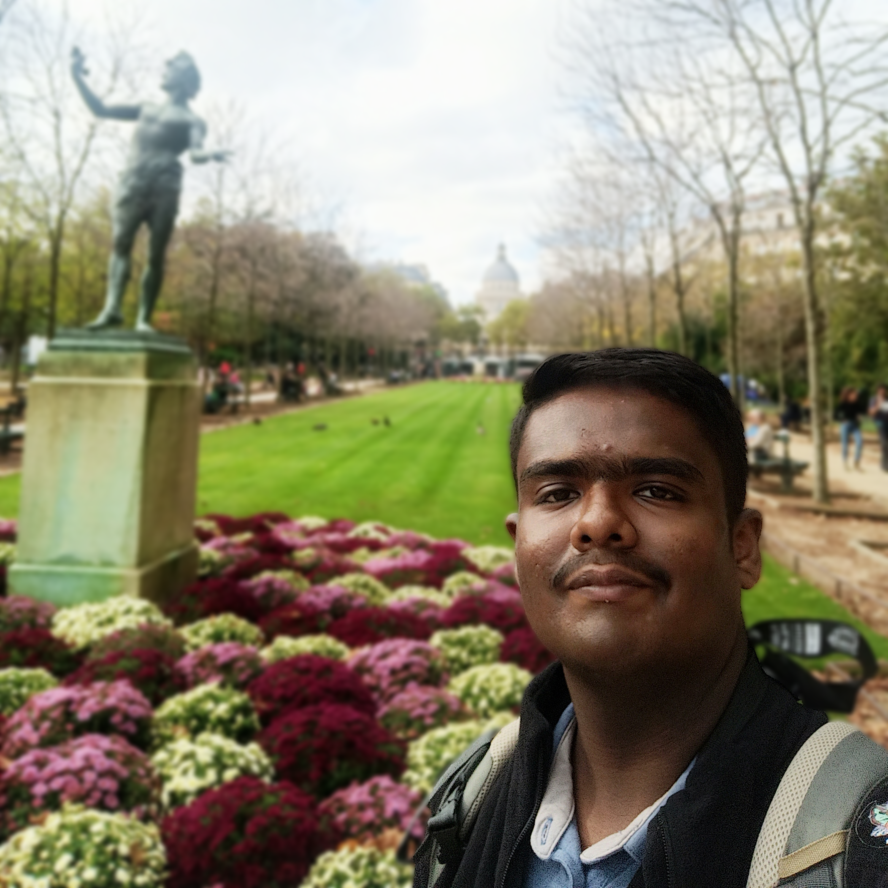
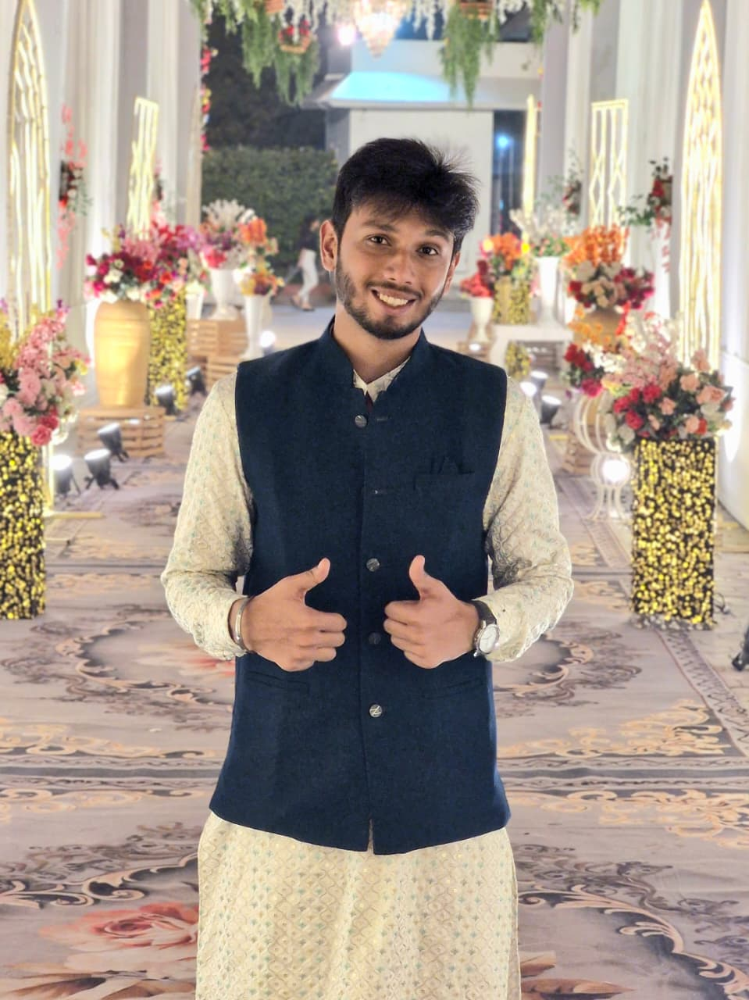
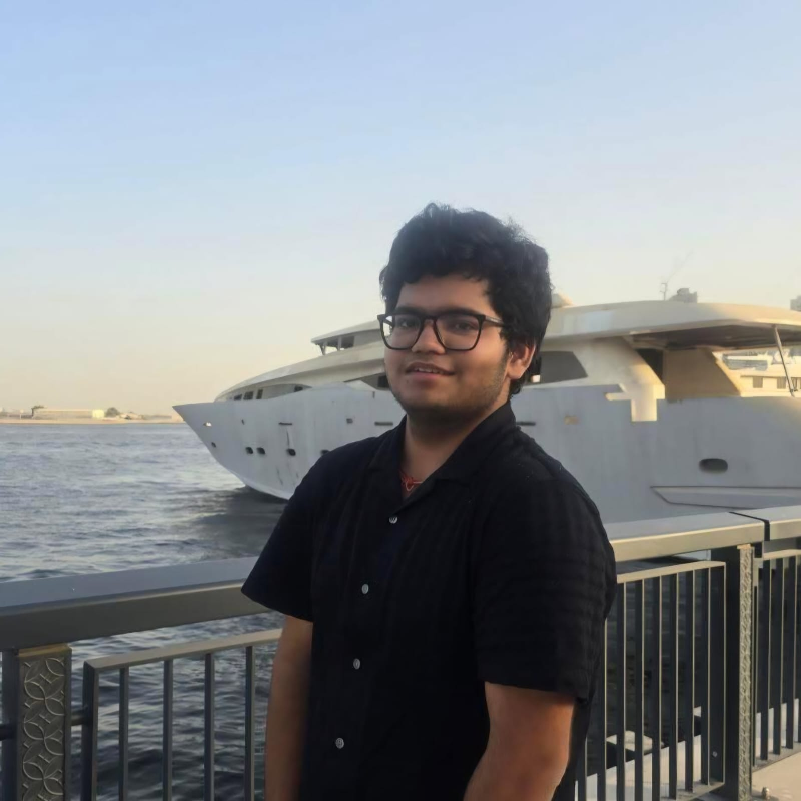

  <h2>Research Interns and External Students</h2>

<table style="width: 130%; margin-left: -15%; border-collapse: collapse; font-size: 1.1rem; margin-top: 1rem;">
  <thead>
    <tr>
      <th style="width: 130px;"></th>
      <th style="text-align: left; padding: 8px 20px;">Name</th>
      <th style="text-align: left; padding: 8px 20px;">Duration</th>
      <th style="text-align: left; padding: 8px 20px;">Current position</th>
    </tr>
  </thead>
  <tbody>
    <tr>
      <td style="padding: 10px; text-align: center;">
        
      </td>
      <td style="padding: 8px 20px;">Chaitanya Mamatha Ananda</td>
      <td style="padding: 8px 20px;">July 2019 - May 2022</td>
      <td style="padding: 8px 20px;">Ph.D. at UC Riverside, USA</td>
    </tr>
    <tr>
      <td style="padding: 10px; text-align: center;">
        
      </td>
      <td style="padding: 8px 20px;">Surya Narayanan R</td>
      <td style="padding: 8px 20px;">December 2020 - May 2022</td>
      <td style="padding: 8px 20px;">Ph.D. at UMN Twin Cities, USA</td>
    </tr>
    <tr>
      <td style="padding: 10px; text-align: center;">
        
      </td>
      <td style="padding: 8px 20px;">Ranjan Bhat</td>
      <td style="padding: 8px 20px;">January 2023 - July 2024</td>
      <td style="padding: 8px 20px;">M.S. at Georgia Tech, USA</td>
    </tr>
    <tr>
      <td style="padding: 10px; text-align: center;">
        
      </td>
      <td style="padding: 8px 20px;">Aparna Reniguntla</td>
      <td style="padding: 8px 20px;">January 2024 - July 2024</td>
      <td style="padding: 8px 20px;">MS at TU Delft, NL</td>
    </tr>
    <tr>
      <td style="padding: 10px; text-align: center;">
        
      </td>
      <td style="padding: 8px 20px;">Ruthwik Chivukula</td>
      <td style="padding: 8px 20px;">December 2023 - July 2024</td>
      <td style="padding: 8px 20px;">Ph.D. at Brown University, USA</td>
    </tr>
    <tr>
      <td style="padding: 10px; text-align: center;">
        
          
        
      </td>
      <td style="padding: 8px 20px;">Akriti Kumari</td>
      <td style="padding: 8px 20px;">May 2025 - present</td>
      <td style="padding: 8px 20px;">B.S.+M.S. at IISER Trivandrum</td>
    </tr>
    <tr>
      <td style="padding: 10px; text-align: center;">
        
      </td>
      <td style="padding: 8px 20px;">Ankana Pari</td>
      <td style="padding: 8px 20px;">May 2025 - July 2025</td>
      <td style="padding: 8px 20px;">B.Tech. at IIT Kharagpur</td>
    </tr>
    <tr>
      <td style="padding: 10px; text-align: center;">
        
      </td>
      <td style="padding: 8px 20px;">Anushka V</td>
      <td style="padding: 8px 20px;">May 2025 - present</td>
      <td style="padding: 8px 20px;">B.Tech.+M.Tech. at IIT Madras</td>
    </tr>
    <tr>
      <td style="padding: 10px; text-align: center;">
        
          
        
      </td>
      <td style="padding: 8px 20px;">Om Inamdar</td>
      <td style="padding: 8px 20px;">May 2025 - present</td>
      <td style="padding: 8px 20px;">B.Tech. at IIT Bombay</td>
    </tr>
    <tr>
      <td style="padding: 10px; text-align: center;">
        
      </td>
      <td style="padding: 8px 20px;">Ronalyn Sequeira</td>
      <td style="padding: 8px 20px;">May 2025 - December 2025</td>
      <td style="padding: 8px 20px;">B.Tech.+M.Tech. at IIT Madras</td>
    </tr>
    <tr>
      <td style="padding: 10px; text-align: center;">
        
      </td>
      <td style="padding: 8px 20px;">Shabarish Balaji</td>
      <td style="padding: 8px 20px;">May 2025 - December 2025</td>
      <td style="padding: 8px 20px;">B.Tech. at IIT Madras</td>
    </tr>
    <tr>
      <td style="padding: 10px; text-align: center;">
        
          
        
      </td>
      <td style="padding: 8px 20px;">Kushagreek Basu</td>
      <td style="padding: 8px 20px;">May 2026 - present</td>
      <td style="padding: 8px 20px;">B.Tech. at IIT Gandhinagar</td>
    </tr>
    <tr>
      <td style="padding: 10px; text-align: center;">
        
          
        
      </td>
      <td style="padding: 8px 20px;">Abinav Thangaraju Sethupathy</td>
      <td style="padding: 8px 20px;">May 2026 - present</td>
      <td style="padding: 8px 20px;">B.Tech. at IISc Bengaluru</td>
    </tr>
    <tr>
      <td style="padding: 10px; text-align: center;">
        
          
        
      </td>
      <td style="padding: 8px 20px;">Shashank Pai</td>
      <td style="padding: 8px 20px;">May 2026 - present</td>
      <td style="padding: 8px 20px;">B.Tech. at NITK</td>
    </tr>
    <tr>
      <td style="padding: 10px; text-align: center;">
        
          
        
      </td>
      <td style="padding: 8px 20px;">Aldis Daniel</td>
      <td style="padding: 8px 20px;">May 2026 - present</td>
      <td style="padding: 8px 20px;">B.Tech.+M.Tech. at IIT Madras</td>
    </tr>
    <tr>
      <td style="padding: 10px; text-align: center;">
        
          
        
      </td>
      <td style="padding: 8px 20px;">Yash Dewangan</td>
      <td style="padding: 8px 20px;">May 2026 - present</td>
      <td style="padding: 8px 20px;">B.Sc. at IISc Bengaluru</td>
    </tr>
    <tr>
      <td style="padding: 10px; text-align: center;">
        
          
        
      </td>
      <td style="padding: 8px 20px;">Raghubir Prasad</td>
      <td style="padding: 8px 20px;">June 2026 - present</td>
      <td style="padding: 8px 20px;">B.Tech. at BITS Dubai</td>
    </tr>
  </tbody>
</table>
